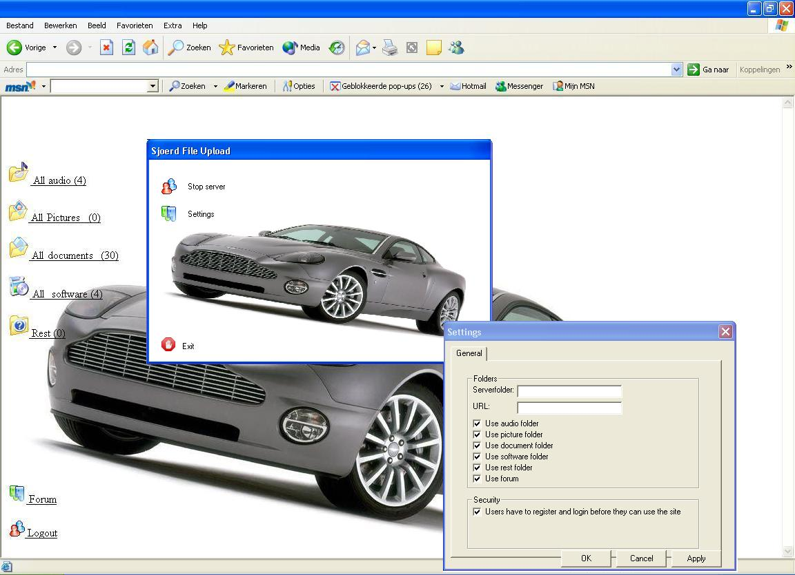



## A Complete downloadserver

### Description

Xcellent downloadserver with preprogrammed site.

Contains much functions and is extremely fast in uploading files (the routine is, the rest depends on your bandwith)

This website pretty much function like a FTP server, coz you have some links that all load a page where you can download

files from a directory with a specific subject.

Ex.

You can download music from the Audio folder.

But you're also able to manage a forum, and even force users to register and login before they can use the site.

Every time a user logs in there will be made a log save in the file: login.ini, located in your serverfolder.

The file settings.ini contains all your settings and is always located in the same directory as the executable (so the executable doesn't have

to be in the server folder)

You can set if you want the forum to be active, if you want users to login, which links must appear, what the serverfolder is and the url of your website

(this will appear for example in the 404 Page not found error)

Please vote and give feedback!!!
 
### More Info
 

             |
---                |---
**Submitted On**   |2004-05-24 20:27:22
**By**             |[Sjoerd](https://github.com/Planet-Source-Code/PSCIndex/blob/master/ByAuthor/sjoerd.md)
**Level**          |Intermediate
**User Rating**    |3.6 (25 globes from 7 users)
**Compatibility**  |VB 6\.0
**Category**       |[Complete Applications](https://github.com/Planet-Source-Code/PSCIndex/blob/master/ByCategory/complete-applications__1-27.md)
**World**          |[Visual Basic](https://github.com/Planet-Source-Code/PSCIndex/blob/master/ByWorld/visual-basic.md)
**Archive File**   |[A\_Complete1750125252004\.zip](https://github.com/Planet-Source-Code/sjoerd-a-complete-downloadserver__1-54010/archive/master.zip)

